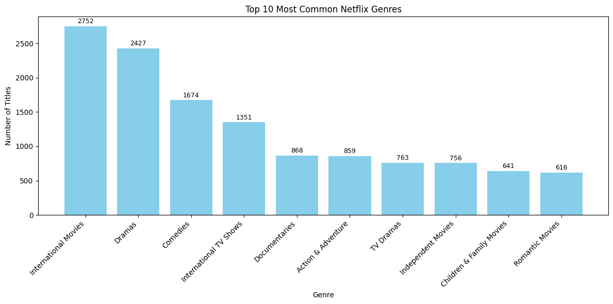

# 📺 Netflix Genre Analysis Project

This is a beginner-friendly data analysis project focused on exploring the **Netflix content library** using Python, pandas, and matplotlib.

---

##Project Goal

To analyze the most common content genres on Netflix and uncover trends in the type of content available, using real-world data.

---

##Tools Used

- Python
- pandas
- matplotlib

---

## Steps Performed

1. **Loaded and cleaned** the Netflix dataset (removed nulls and irrelevant columns).
2. Extracted and **counted each genre** using the `listed_in` column.
3. Identified the **Top 10 most common genres**.
4. Plotted a **bar chart with genre counts** and labeled each bar for clarity.

---

## Visualization

A bar chart was created to visualize the top 10 genres by count.

> 

---

## Key Insight

Netflix offers a **high number of International Movies and Dramas**, making these the dominant content categories. Comedies and TV shows also make up a large portion of the library.

---

## Files Included

- `netflix_genre_analysis.ipynb` — Jupyter notebook with full code
- `top_netflix_genres.png` — The final bar chart

---

## 🧠 What I Learned

- How to clean and explore real-world datasets
- How to extract meaningful information from messy columns
- How to create beautiful visualizations using matplotlib
